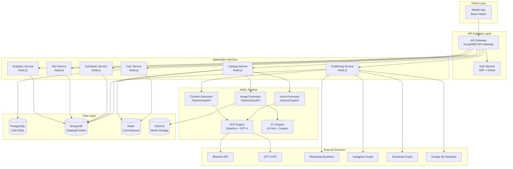

# Design Document: BizBoost AI Platform

## Overview

BizBoost AI is a voice-first, AI-powered content creation platform designed specifically for India's small business market. The platform enables non-technical users to create professional digital content through a simple 4-step process: Speak → Photo → Process → Publish. The system architecture follows a microservices pattern with clear separation between the mobile frontend, API gateway, business logic services, AI/ML processing pipeline, and data storage layers.

### Key Design Principles

1. **Simplicity First**: Every interaction optimized for non-technical users with minimal steps
2. **Voice-First**: Voice input as the primary interaction method, reducing typing barriers
3. **Offline-Capable**: Core features work offline with background sync when connected
4. **Regional Language Native**: Not just translation, but culturally appropriate content generation
5. **Scalable Architecture**: Microservices design supporting growth from 1K to 100K+ users
6. **AI-Augmented**: AI handles complexity, users provide business context
7. **Platform Agnostic**: Abstract publishing logic to support any social/business platform

## Architecture

### High-Level System Architecture



### Technology Stack

**Frontend:**
- React Native 0.72+ for cross-platform mobile development
- Redux Toolkit for state management
- React Navigation for routing
- Axios for API communication
- React Native Voice for audio recording
- React Native Image Picker for photo capture

**Backend Services (Node.js):**
- Express.js 4.18+ for REST APIs
- TypeScript for type safety
- Joi for request validation
- Winston for logging
- Bull for job queues

**AI/ML Services (Python):**
- FastAPI 0.100+ for high-performance APIs
- PyTorch 2.0+ for deep learning models
- Transformers library for NLP
- OpenCV for image processing
- Celery for async task processing

**Data Storage:**
- PostgreSQL 15+ for relational data (users, subscriptions, transactions)
- MongoDB 6.0+ for document data (catalogs, content, analytics)
- Redis 7.0+ for caching and message queues
- AWS S3 / Google Cloud Storage for media files

**Infrastructure:**
- Docker for containerization
- Kubernetes for orchestration
- AWS / Google Cloud for hosting
- CloudFront / Cloud CDN for content delivery
- GitHub Actions for CI/CD


## Components and Interfaces

### 1. Mobile Application (React Native)

**Responsibilities:**
- Provide intuitive UI for voice recording, photo capture, and content management
- Handle offline data storage and sync
- Manage user authentication state
- Display analytics and insights
- Handle push notifications

**Key Modules:**

```typescript
// Voice Recording Module
interface VoiceRecorder {
  startRecording(): Promise<void>;
  stopRecording(): Promise<AudioFile>;
  getPermissions(): Promise<boolean>;
}

// Photo Capture Module
interface PhotoCapture {
  openCamera(): Promise<ImageFile>;
  selectFromGallery(): Promise<ImageFile>;
  getPermissions(): Promise<boolean>;
}

// Offline Storage Module
interface OfflineStorage {
  saveDraft(catalogEntry: CatalogEntry): Promise<void>;
  getDrafts(): Promise<CatalogEntry[]>;
  syncWithServer(): Promise<SyncResult>;
}

// API Client Module
interface APIClient {
  authenticate(credentials: Credentials): Promise<AuthToken>;
  uploadVoice(audio: AudioFile): Promise<TranscriptionResult>;
  uploadImage(image: ImageFile): Promise<EnhancedImage>;
  createCatalogEntry(entry: CatalogEntry): Promise<CatalogEntry>;
  publishContent(content: Content, platforms: Platform[]): Promise<PublishResult>;
}
```

### 2. API Gateway

**Responsibilities:**
- Route requests to appropriate microservices
- Handle authentication and authorization
- Implement rate limiting and throttling
- Aggregate responses from multiple services
- Transform requests/responses as needed

**Configuration:**

```yaml
routes:
  - path: /api/v1/auth/*
    service: auth-service
    rate_limit: 10/minute
    
  - path: /api/v1/catalog/*
    service: catalog-service
    auth_required: true
    rate_limit: 100/minute
    
  - path: /api/v1/publish/*
    service: publishing-service
    auth_required: true
    rate_limit: 50/minute
    
  - path: /api/v1/analytics/*
    service: analytics-service
    auth_required: true
    rate_limit: 100/minute
```

### 3. User Service (Node.js)

**Responsibilities:**
- User registration and authentication
- Profile management
- Subscription management
- Business profile configuration

**API Endpoints:**

```typescript
// User Management
POST   /api/v1/users/register          // Register new user
POST   /api/v1/users/verify-otp        // Verify OTP
POST   /api/v1/users/login             // Login with credentials
POST   /api/v1/users/refresh-token     // Refresh JWT token
GET    /api/v1/users/profile           // Get user profile
PUT    /api/v1/users/profile           // Update user profile
DELETE /api/v1/users/account           // Delete user account

// Business Profile
POST   /api/v1/users/business          // Create business profile
GET    /api/v1/users/business/:id      // Get business profile
PUT    /api/v1/users/business/:id      // Update business profile
GET    /api/v1/users/businesses        // List all user businesses

// Subscription
GET    /api/v1/users/subscription      // Get current subscription
POST   /api/v1/users/subscription      // Create/upgrade subscription
DELETE /api/v1/users/subscription      // Cancel subscription
```

**Data Models:**

```typescript
interface User {
  id: string;
  phoneNumber: string;
  phoneVerified: boolean;
  passwordHash: string;
  preferredLanguage: string;
  createdAt: Date;
  updatedAt: Date;
}

interface BusinessProfile {
  id: string;
  userId: string;
  businessName: string;
  category: string;
  description: string;
  location: {
    address: string;
    city: string;
    state: string;
    pincode: string;
  };
  contactInfo: {
    phone: string;
    email: string;
    whatsapp: string;
  };
  settings: {
    deliveryAvailable: boolean;
    deliveryRadius: number;
    paymentMethods: string[];
    businessHours: BusinessHours[];
  };
}

interface Subscription {
  id: string;
  userId: string;
  tier: 'free' | 'pro' | 'premium';
  status: 'active' | 'expired' | 'cancelled';
  startDate: Date;
  endDate: Date;
  autoRenew: boolean;
  paymentMethod: string;
}
```


### 4. Catalog Service (Node.js)

**Responsibilities:**
- Manage product catalog CRUD operations
- Coordinate voice-to-catalog workflow
- Coordinate photo enhancement workflow
- Handle bulk import/export
- Manage product categories

**API Endpoints:**

```typescript
// Catalog Management
POST   /api/v1/catalog/entries          // Create catalog entry
GET    /api/v1/catalog/entries          // List catalog entries
GET    /api/v1/catalog/entries/:id      // Get specific entry
PUT    /api/v1/catalog/entries/:id      // Update entry
DELETE /api/v1/catalog/entries/:id      // Delete entry
POST   /api/v1/catalog/entries/:id/duplicate  // Duplicate entry

// Voice-to-Catalog Workflow
POST   /api/v1/catalog/voice-upload     // Upload voice recording
GET    /api/v1/catalog/voice-status/:id // Check processing status
POST   /api/v1/catalog/voice-confirm    // Confirm and save entry

// Photo Enhancement Workflow
POST   /api/v1/catalog/photo-upload     // Upload product photo
GET    /api/v1/catalog/photo-status/:id // Check processing status
POST   /api/v1/catalog/photo-confirm    // Confirm enhanced photo

// Bulk Operations
POST   /api/v1/catalog/import           // Import from CSV
GET    /api/v1/catalog/export           // Export to CSV

// Categories
GET    /api/v1/catalog/categories       // List categories
POST   /api/v1/catalog/categories       // Create category
PUT    /api/v1/catalog/categories/:id   // Update category
DELETE /api/v1/catalog/categories/:id   // Delete category
```

**Data Models:**

```typescript
interface CatalogEntry {
  id: string;
  userId: string;
  businessId: string;
  productName: string;
  description: {
    [language: string]: string;  // Multi-language descriptions
  };
  price: number;
  currency: string;
  category: string;
  images: {
    original: string;      // S3 URL
    enhanced: string;      // S3 URL
    thumbnail: string;     // S3 URL
  }[];
  status: 'active' | 'inactive' | 'draft';
  metadata: {
    createdVia: 'voice' | 'manual' | 'import';
    voiceRecordingUrl?: string;
    originalPhotoUrl?: string;
  };
  inventory: {
    available: boolean;
    quantity?: number;
  };
  createdAt: Date;
  updatedAt: Date;
  version: number;
}

interface Category {
  id: string;
  userId: string;
  name: string;
  icon: string;
  productCount: number;
  createdAt: Date;
}
```

**Workflow Orchestration:**

```typescript
// Voice-to-Catalog Workflow
class VoiceToCatalogWorkflow {
  async execute(audioFile: AudioFile, userId: string): Promise<CatalogEntry> {
    // Step 1: Upload audio to S3
    const audioUrl = await this.uploadAudio(audioFile);
    
    // Step 2: Send to Voice Processor for transcription
    const transcription = await this.voiceProcessor.transcribe(audioUrl, language);
    
    // Step 3: Extract structured data using NLP
    const extractedData = await this.voiceProcessor.extractProductInfo(transcription);
    
    // Step 4: Generate professional descriptions
    const descriptions = await this.contentGenerator.generateDescriptions(
      extractedData,
      language
    );
    
    // Step 5: Create draft catalog entry
    const draftEntry = await this.catalogRepository.createDraft({
      ...extractedData,
      description: descriptions,
      status: 'draft'
    });
    
    return draftEntry;
  }
}

// Photo Enhancement Workflow
class PhotoEnhancementWorkflow {
  async execute(imageFile: ImageFile, catalogEntryId: string): Promise<EnhancedImage> {
    // Step 1: Upload original to S3
    const originalUrl = await this.uploadImage(imageFile);
    
    // Step 2: Detect primary object
    const detection = await this.imageProcessor.detectObject(originalUrl);
    
    // Step 3: Remove background
    const backgroundRemoved = await this.imageProcessor.removeBackground(
      originalUrl,
      detection.boundingBox
    );
    
    // Step 4: Enhance lighting
    const enhanced = await this.imageProcessor.enhanceLighting(backgroundRemoved);
    
    // Step 5: Generate multiple sizes
    const sizes = await this.imageProcessor.generateSizes(enhanced);
    
    // Step 6: Update catalog entry
    await this.catalogRepository.updateImages(catalogEntryId, sizes);
    
    return sizes;
  }
}
```


### 5. Voice Processor Service (Python/FastAPI)

**Responsibilities:**
- Transcribe audio to text using Bhashini API
- Extract structured product information from transcription
- Handle multiple regional languages
- Implement fallback to Google Speech-to-Text

**API Endpoints:**

```python
# Voice Processing
POST   /api/v1/voice/transcribe         # Transcribe audio to text
POST   /api/v1/voice/extract-info       # Extract product info from text
POST   /api/v1/voice/process            # Combined transcribe + extract
```

**Implementation:**

```python
from fastapi import FastAPI, UploadFile
from typing import Dict, Optional
import httpx

class VoiceProcessor:
    def __init__(self):
        self.bhashini_client = BhashiniClient()
        self.google_stt_client = GoogleSTTClient()
        self.nlp_extractor = ProductInfoExtractor()
    
    async def transcribe(
        self,
        audio_url: str,
        language: str,
        fallback: bool = True
    ) -> TranscriptionResult:
        """
        Transcribe audio to text using Bhashini API with Google STT fallback.
        """
        try:
            # Primary: Bhashini API for Indian languages
            result = await self.bhashini_client.transcribe(audio_url, language)
            return TranscriptionResult(
                text=result.text,
                confidence=result.confidence,
                language=language,
                provider='bhashini'
            )
        except BhashiniAPIError as e:
            if fallback:
                # Fallback: Google Speech-to-Text
                result = await self.google_stt_client.transcribe(audio_url, language)
                return TranscriptionResult(
                    text=result.text,
                    confidence=result.confidence,
                    language=language,
                    provider='google'
                )
            raise
    
    async def extract_product_info(
        self,
        text: str,
        language: str
    ) -> ProductInfo:
        """
        Extract structured product information from transcribed text.
        Uses GPT-4 with custom prompts for each language.
        """
        prompt = self._build_extraction_prompt(text, language)
        
        response = await self.gpt4_client.complete(
            prompt=prompt,
            temperature=0.3,  # Low temperature for consistent extraction
            max_tokens=500
        )
        
        # Parse GPT-4 response into structured format
        product_info = self._parse_extraction_response(response)
        
        # Validate extracted information
        validated_info = self._validate_product_info(product_info)
        
        return validated_info
    
    def _build_extraction_prompt(self, text: str, language: str) -> str:
        """
        Build language-specific prompt for product information extraction.
        """
        prompts = {
            'hindi': f"""
            निम्नलिखित विवरण से उत्पाद की जानकारी निकालें:
            "{text}"
            
            JSON format में दें:
            - productName: उत्पाद का नाम
            - price: कीमत (केवल संख्या)
            - description: संक्षिप्त विवरण
            """,
            'english': f"""
            Extract product information from the following description:
            "{text}"
            
            Provide in JSON format:
            - productName: name of the product
            - price: price (number only)
            - description: brief description
            """
        }
        return prompts.get(language, prompts['english'])
    
    def _validate_product_info(self, info: Dict) -> ProductInfo:
        """
        Validate and normalize extracted product information.
        """
        # Ensure required fields
        if not info.get('productName'):
            raise ValidationError("Product name is required")
        
        # Normalize price (handle regional formats)
        price = self._normalize_price(info.get('price', 0))
        
        # Generate description if missing
        description = info.get('description') or info.get('productName')
        
        return ProductInfo(
            productName=info['productName'],
            price=price,
            description=description,
            confidence=info.get('confidence', 0.8)
        )
    
    def _normalize_price(self, price_text: str) -> float:
        """
        Convert regional price formats to numeric value.
        Examples: "do sau rupaye" -> 200, "₹500" -> 500
        """
        # Remove currency symbols
        cleaned = price_text.replace('₹', '').replace('rupaye', '').strip()
        
        # Handle word-to-number conversion for Hindi
        if any(word in cleaned for word in ['sau', 'hazaar', 'lakh']):
            return self._hindi_words_to_number(cleaned)
        
        # Parse numeric value
        try:
            return float(cleaned)
        except ValueError:
            return 0.0
```


### 6. Image Processor Service (Python/FastAPI)

**Responsibilities:**
- Remove backgrounds using U2-Net model
- Enhance lighting and colors
- Detect and crop product objects
- Generate multiple image sizes
- Validate image quality

**API Endpoints:**

```python
POST   /api/v1/image/detect-object      # Detect primary product object
POST   /api/v1/image/remove-background  # Remove background
POST   /api/v1/image/enhance            # Enhance lighting/colors
POST   /api/v1/image/process            # Complete enhancement pipeline
POST   /api/v1/image/generate-sizes     # Generate multiple sizes
```

**Implementation:**

```python
import torch
import cv2
import numpy as np
from PIL import Image
from u2net import U2NET

class ImageProcessor:
    def __init__(self):
        # Load U2-Net model for background removal
        self.u2net_model = self._load_u2net_model()
        self.object_detector = self._load_object_detector()
    
    def _load_u2net_model(self) -> U2NET:
        """Load pre-trained U2-Net model."""
        model = U2NET(3, 1)
        model.load_state_dict(torch.load('models/u2net.pth'))
        model.eval()
        return model
    
    async def detect_object(self, image_url: str) -> ObjectDetection:
        """
        Detect primary product object in image.
        Returns bounding box and confidence score.
        """
        # Download image
        image = await self._download_image(image_url)
        
        # Run object detection
        detections = self.object_detector.detect(image)
        
        # Select primary object (largest bounding box)
        primary = max(detections, key=lambda d: d.area)
        
        return ObjectDetection(
            boundingBox=primary.bbox,
            confidence=primary.confidence,
            label=primary.label
        )
    
    async def remove_background(
        self,
        image_url: str,
        bounding_box: Optional[BoundingBox] = None
    ) -> np.ndarray:
        """
        Remove background using U2-Net model.
        Optionally crop to bounding box first.
        """
        # Download and preprocess image
        image = await self._download_image(image_url)
        
        # Crop to bounding box if provided
        if bounding_box:
            image = self._crop_image(image, bounding_box)
        
        # Prepare input tensor
        input_tensor = self._preprocess_for_u2net(image)
        
        # Run U2-Net inference
        with torch.no_grad():
            mask = self.u2net_model(input_tensor)
        
        # Post-process mask
        mask = self._postprocess_mask(mask)
        
        # Apply mask to remove background
        result = self._apply_mask(image, mask)
        
        return result
    
    async def enhance_lighting(self, image: np.ndarray) -> np.ndarray:
        """
        Enhance image lighting and colors.
        Applies adaptive histogram equalization and color correction.
        """
        # Convert to LAB color space
        lab = cv2.cvtColor(image, cv2.COLOR_RGB2LAB)
        l, a, b = cv2.split(lab)
        
        # Apply CLAHE (Contrast Limited Adaptive Histogram Equalization)
        clahe = cv2.createCLAHE(clipLimit=3.0, tileGridSize=(8, 8))
        l_enhanced = clahe.apply(l)
        
        # Merge channels
        enhanced_lab = cv2.merge([l_enhanced, a, b])
        
        # Convert back to RGB
        enhanced_rgb = cv2.cvtColor(enhanced_lab, cv2.COLOR_LAB2RGB)
        
        # Adjust brightness if too dark
        brightness = np.mean(enhanced_rgb)
        if brightness < 100:
            enhanced_rgb = self._adjust_brightness(enhanced_rgb, target=120)
        
        # Enhance saturation slightly
        enhanced_rgb = self._adjust_saturation(enhanced_rgb, factor=1.2)
        
        return enhanced_rgb
    
    async def process_complete(self, image_url: str) -> ProcessedImage:
        """
        Complete image processing pipeline:
        1. Detect object
        2. Remove background
        3. Enhance lighting
        4. Generate multiple sizes
        """
        # Step 1: Detect object
        detection = await self.detect_object(image_url)
        
        # Step 2: Remove background
        no_bg = await self.remove_background(image_url, detection.boundingBox)
        
        # Step 3: Enhance lighting
        enhanced = await self.enhance_lighting(no_bg)
        
        # Step 4: Generate sizes
        sizes = await self.generate_sizes(enhanced)
        
        return ProcessedImage(
            original=image_url,
            enhanced=sizes['full'],
            thumbnail=sizes['thumbnail'],
            medium=sizes['medium'],
            detection=detection
        )
    
    async def generate_sizes(self, image: np.ndarray) -> Dict[str, str]:
        """
        Generate multiple image sizes and upload to S3.
        - thumbnail: 200x200
        - medium: 800x800
        - full: 1200x1200
        """
        sizes = {
            'thumbnail': (200, 200),
            'medium': (800, 800),
            'full': (1200, 1200)
        }
        
        urls = {}
        for size_name, dimensions in sizes.items():
            resized = self._resize_image(image, dimensions)
            url = await self._upload_to_s3(resized, size_name)
            urls[size_name] = url
        
        return urls
    
    def _validate_image_quality(self, image: np.ndarray) -> ImageQuality:
        """
        Validate image quality (resolution, blur, brightness).
        """
        height, width = image.shape[:2]
        
        # Check resolution
        if width < 480 or height < 480:
            return ImageQuality(
                valid=False,
                reason="Resolution too low (minimum 480p required)"
            )
        
        # Check blur using Laplacian variance
        gray = cv2.cvtColor(image, cv2.COLOR_RGB2GRAY)
        blur_score = cv2.Laplacian(gray, cv2.CV_64F).var()
        
        if blur_score < 100:
            return ImageQuality(
                valid=False,
                reason="Image is too blurry"
            )
        
        return ImageQuality(valid=True, reason="")
```


### 7. Publishing Service (Node.js)

**Responsibilities:**
- Generate platform-specific content versions
- Manage OAuth authentication with publishing platforms
- Coordinate content publishing to multiple platforms
- Handle publishing failures and retries
- Track publishing status

**API Endpoints:**

```typescript
// Platform Connection
POST   /api/v1/publish/connect/:platform     // Initiate OAuth flow
GET    /api/v1/publish/callback/:platform    // OAuth callback
GET    /api/v1/publish/platforms             // List connected platforms
DELETE /api/v1/publish/disconnect/:platform  // Disconnect platform

// Publishing
POST   /api/v1/publish/content               // Publish to selected platforms
GET    /api/v1/publish/status/:id            // Check publishing status
POST   /api/v1/publish/retry/:id             // Retry failed publishing

// Content Generation
POST   /api/v1/publish/generate-versions     // Generate platform-specific versions
```

**Implementation:**

```typescript
class PublishingService {
  private platformAdapters: Map<string, PlatformAdapter>;
  
  constructor() {
    this.platformAdapters = new Map([
      ['whatsapp', new WhatsAppAdapter()],
      ['instagram', new InstagramAdapter()],
      ['facebook', new FacebookAdapter()],
      ['google_business', new GoogleBusinessAdapter()]
    ]);
  }
  
  async publishContent(
    content: Content,
    platforms: string[],
    userId: string
  ): Promise<PublishResult> {
    // Generate platform-specific versions
    const versions = await this.generatePlatformVersions(content, platforms);
    
    // Publish to each platform in parallel
    const publishPromises = platforms.map(async (platform) => {
      const adapter = this.platformAdapters.get(platform);
      const version = versions[platform];
      
      try {
        const result = await adapter.publish(version, userId);
        return {
          platform,
          status: 'success',
          postUrl: result.url,
          postId: result.id
        };
      } catch (error) {
        return {
          platform,
          status: 'failed',
          error: error.message
        };
      }
    });
    
    const results = await Promise.allSettled(publishPromises);
    
    // Store publishing record
    await this.storePublishingRecord(userId, content, results);
    
    return {
      contentId: content.id,
      results: results.map(r => r.status === 'fulfilled' ? r.value : r.reason),
      timestamp: new Date()
    };
  }
  
  async generatePlatformVersions(
    content: Content,
    platforms: string[]
  ): Promise<Record<string, PlatformContent>> {
    const versions: Record<string, PlatformContent> = {};
    
    for (const platform of platforms) {
      const adapter = this.platformAdapters.get(platform);
      versions[platform] = await adapter.adaptContent(content);
    }
    
    return versions;
  }
}

// Platform Adapter Interface
interface PlatformAdapter {
  adaptContent(content: Content): Promise<PlatformContent>;
  publish(content: PlatformContent, userId: string): Promise<PublishResponse>;
  authenticate(userId: string): Promise<AuthToken>;
  refreshToken(userId: string): Promise<AuthToken>;
}

// WhatsApp Business Adapter
class WhatsAppAdapter implements PlatformAdapter {
  async adaptContent(content: Content): Promise<PlatformContent> {
    return {
      platform: 'whatsapp',
      text: this.truncateText(content.description, 1000),
      image: await this.resizeImage(content.image, 800, 800),
      metadata: {
        productName: content.productName,
        price: content.price,
        currency: content.currency
      }
    };
  }
  
  async publish(
    content: PlatformContent,
    userId: string
  ): Promise<PublishResponse> {
    // Get user's WhatsApp Business credentials
    const credentials = await this.getCredentials(userId);
    
    // Create catalog item via WhatsApp Business API
    const response = await axios.post(
      `https://graph.facebook.com/v17.0/${credentials.phoneNumberId}/catalog`,
      {
        name: content.metadata.productName,
        description: content.text,
        price: content.metadata.price,
        currency: content.metadata.currency,
        image_url: content.image,
        availability: 'in stock'
      },
      {
        headers: {
          'Authorization': `Bearer ${credentials.accessToken}`,
          'Content-Type': 'application/json'
        }
      }
    );
    
    return {
      id: response.data.id,
      url: `https://wa.me/c/${credentials.phoneNumberId}`,
      platform: 'whatsapp'
    };
  }
  
  async authenticate(userId: string): Promise<AuthToken> {
    // Implement OAuth flow for WhatsApp Business
    // Returns access token and refresh token
  }
  
  async refreshToken(userId: string): Promise<AuthToken> {
    // Refresh expired access token
  }
}

// Instagram Adapter
class InstagramAdapter implements PlatformAdapter {
  async adaptContent(content: Content): Promise<PlatformContent> {
    return {
      platform: 'instagram',
      text: this.formatCaption(content, 2200), // Instagram caption limit
      image: await this.resizeImage(content.image, 1080, 1080),
      hashtags: this.generateHashtags(content)
    };
  }
  
  async publish(
    content: PlatformContent,
    userId: string
  ): Promise<PublishResponse> {
    const credentials = await this.getCredentials(userId);
    
    // Step 1: Create media container
    const containerResponse = await axios.post(
      `https://graph.facebook.com/v17.0/${credentials.instagramAccountId}/media`,
      {
        image_url: content.image,
        caption: `${content.text}\n\n${content.hashtags.join(' ')}`
      },
      {
        headers: { 'Authorization': `Bearer ${credentials.accessToken}` }
      }
    );
    
    // Step 2: Publish media container
    const publishResponse = await axios.post(
      `https://graph.facebook.com/v17.0/${credentials.instagramAccountId}/media_publish`,
      {
        creation_id: containerResponse.data.id
      },
      {
        headers: { 'Authorization': `Bearer ${credentials.accessToken}` }
      }
    );
    
    return {
      id: publishResponse.data.id,
      url: `https://www.instagram.com/p/${publishResponse.data.id}`,
      platform: 'instagram'
    };
  }
  
  formatCaption(content: Content, maxLength: number): string {
    let caption = `${content.productName}\n\n${content.description}\n\n`;
    caption += `💰 Price: ${content.currency} ${content.price}\n`;
    caption += `📞 Contact us to order!`;
    
    return caption.substring(0, maxLength);
  }
  
  generateHashtags(content: Content): string[] {
    // Generate relevant hashtags based on product category and name
    const baseHashtags = ['#SmallBusiness', '#MadeInIndia', '#ShopLocal'];
    const categoryHashtags = this.getCategoryHashtags(content.category);
    return [...baseHashtags, ...categoryHashtags].slice(0, 30); // Instagram limit
  }
}
```


### 8. Content Scheduler Service (Node.js)

**Responsibilities:**
- Maintain festival and seasonal calendar
- Generate festival-specific content
- Schedule content for optimal posting times
- Execute scheduled posts
- Send scheduling notifications

**API Endpoints:**

```typescript
POST   /api/v1/scheduler/schedule          // Schedule content
GET    /api/v1/scheduler/scheduled         // List scheduled content
PUT    /api/v1/scheduler/scheduled/:id     // Update scheduled content
DELETE /api/v1/scheduler/scheduled/:id     // Cancel scheduled content
GET    /api/v1/scheduler/festivals         // List upcoming festivals
POST   /api/v1/scheduler/auto-generate     // Generate festival content
PUT    /api/v1/scheduler/settings          // Update auto-schedule settings
```

**Implementation:**

```typescript
class ContentScheduler {
  private festivalCalendar: FestivalCalendar;
  private contentGenerator: ContentGenerator;
  private publishingService: PublishingService;
  
  constructor() {
    this.festivalCalendar = new FestivalCalendar();
    this.initializeScheduler();
  }
  
  private initializeScheduler() {
    // Run daily job to check for upcoming festivals
    cron.schedule('0 0 * * *', async () => {
      await this.checkUpcomingFestivals();
    });
    
    // Run every hour to execute scheduled posts
    cron.schedule('0 * * * *', async () => {
      await this.executeScheduledPosts();
    });
  }
  
  async checkUpcomingFestivals(): Promise<void> {
    const upcomingFestivals = this.festivalCalendar.getUpcoming(7); // 7 days ahead
    
    for (const festival of upcomingFestivals) {
      // Get users with auto-scheduling enabled
      const users = await this.getUsersWithAutoSchedule();
      
      for (const user of users) {
        await this.generateFestivalContent(user, festival);
      }
    }
  }
  
  async generateFestivalContent(
    user: User,
    festival: Festival
  ): Promise<ScheduledContent> {
    // Get user's top products
    const topProducts = await this.getTopProducts(user.id, 3);
    
    // Generate festival-specific content
    const content = await this.contentGenerator.generateFestivalPost({
      festival: festival.name,
      language: user.preferredLanguage,
      products: topProducts,
      businessName: user.businessName,
      culturalContext: festival.culturalContext
    });
    
    // Determine optimal posting time
    const postTime = this.calculateOptimalTime(festival.date, user.timezone);
    
    // Create scheduled content
    const scheduled = await this.scheduleContent({
      userId: user.id,
      content: content,
      scheduledTime: postTime,
      platforms: user.connectedPlatforms,
      type: 'festival',
      festivalId: festival.id,
      status: user.autoScheduleEnabled ? 'approved' : 'pending_review'
    });
    
    // Send notification
    await this.notifyUser(user.id, scheduled);
    
    return scheduled;
  }
  
  calculateOptimalTime(festivalDate: Date, timezone: string): Date {
    // Post 2 days before festival at 10 AM local time
    const postDate = new Date(festivalDate);
    postDate.setDate(postDate.getDate() - 2);
    postDate.setHours(10, 0, 0, 0);
    return postDate;
  }
  
  async executeScheduledPosts(): Promise<void> {
    const now = new Date();
    
    // Get posts scheduled for this hour
    const scheduledPosts = await this.getPostsDueForExecution(now);
    
    for (const post of scheduledPosts) {
      try {
        // Publish content
        const result = await this.publishingService.publishContent(
          post.content,
          post.platforms,
          post.userId
        );
        
        // Update status
        await this.updateScheduledPost(post.id, {
          status: 'published',
          publishedAt: now,
          publishResult: result
        });
        
        // Notify user
        await this.notifyPublishSuccess(post.userId, post.id);
      } catch (error) {
        // Handle failure
        await this.updateScheduledPost(post.id, {
          status: 'failed',
          error: error.message
        });
        
        await this.notifyPublishFailure(post.userId, post.id, error);
      }
    }
  }
}

// Festival Calendar
class FestivalCalendar {
  private festivals: Festival[] = [
    {
      id: 'diwali',
      name: 'Diwali',
      date: new Date('2024-11-01'),
      regions: ['all'],
      culturalContext: {
        themes: ['lights', 'prosperity', 'new_beginnings'],
        colors: ['gold', 'red', 'orange'],
        greetings: {
          hindi: 'दीपावली की शुभकामनाएं',
          english: 'Happy Diwali'
        }
      }
    },
    {
      id: 'holi',
      name: 'Holi',
      date: new Date('2024-03-25'),
      regions: ['north', 'west'],
      culturalContext: {
        themes: ['colors', 'joy', 'celebration'],
        colors: ['rainbow', 'vibrant'],
        greetings: {
          hindi: 'होली की शुभकामनाएं',
          english: 'Happy Holi'
        }
      }
    },
    // ... more festivals
  ];
  
  getUpcoming(days: number): Festival[] {
    const now = new Date();
    const futureDate = new Date(now.getTime() + days * 24 * 60 * 60 * 1000);
    
    return this.festivals.filter(f => 
      f.date >= now && f.date <= futureDate
    );
  }
}
```


### 9. Customer Engagement Bot Service (Node.js)

**Responsibilities:**
- Handle customer queries in multiple languages
- Retrieve information from user's catalog
- Provide automated responses for common queries
- Escalate complex queries to business owner
- Log all conversations

**API Endpoints:**

```typescript
POST   /api/v1/bot/message                 // Process customer message
GET    /api/v1/bot/conversations           // List conversations
GET    /api/v1/bot/conversations/:id       // Get conversation details
POST   /api/v1/bot/escalate/:id            // Escalate to human
PUT    /api/v1/bot/custom-responses        // Configure custom responses
GET    /api/v1/bot/analytics               // Bot performance analytics
```

**Implementation:**

```typescript
class EngagementBot {
  private nlpEngine: NLPEngine;
  private catalogService: CatalogService;
  private intentClassifier: IntentClassifier;
  
  async processMessage(
    message: string,
    customerId: string,
    businessId: string,
    platform: string
  ): Promise<BotResponse> {
    // Detect language
    const language = await this.nlpEngine.detectLanguage(message);
    
    // Classify intent
    const intent = await this.intentClassifier.classify(message, language);
    
    // Generate response based on intent
    let response: string;
    let requiresEscalation = false;
    
    switch (intent.type) {
      case 'price_inquiry':
        response = await this.handlePriceInquiry(message, businessId, language);
        break;
      
      case 'availability_inquiry':
        response = await this.handleAvailabilityInquiry(message, businessId, language);
        break;
      
      case 'delivery_inquiry':
        response = await this.handleDeliveryInquiry(businessId, language);
        break;
      
      case 'business_hours':
        response = await this.handleBusinessHours(businessId, language);
        break;
      
      case 'location_inquiry':
        response = await this.handleLocationInquiry(businessId, language);
        break;
      
      case 'payment_methods':
        response = await this.handlePaymentMethods(businessId, language);
        break;
      
      default:
        // Unknown intent - escalate to human
        response = await this.getEscalationMessage(language);
        requiresEscalation = true;
    }
    
    // Log conversation
    await this.logConversation({
      customerId,
      businessId,
      platform,
      message,
      response,
      intent: intent.type,
      language,
      escalated: requiresEscalation,
      timestamp: new Date()
    });
    
    // Notify business owner if escalation needed
    if (requiresEscalation) {
      await this.notifyBusinessOwner(businessId, customerId, message);
    }
    
    return {
      response,
      language,
      requiresEscalation,
      confidence: intent.confidence
    };
  }
  
  async handlePriceInquiry(
    message: string,
    businessId: string,
    language: string
  ): Promise<string> {
    // Extract product name from message
    const productName = await this.nlpEngine.extractProductName(message, language);
    
    if (!productName) {
      return this.getTemplateResponse('price_inquiry_unclear', language);
    }
    
    // Search catalog for product
    const products = await this.catalogService.searchProducts(businessId, productName);
    
    if (products.length === 0) {
      return this.getTemplateResponse('product_not_found', language, { productName });
    }
    
    if (products.length === 1) {
      const product = products[0];
      return this.getTemplateResponse('price_single', language, {
        productName: product.name,
        price: product.price,
        currency: product.currency
      });
    }
    
    // Multiple products found
    return this.getTemplateResponse('price_multiple', language, {
      products: products.map(p => `${p.name}: ${p.currency} ${p.price}`).join('\n')
    });
  }
  
  async handleAvailabilityInquiry(
    message: string,
    businessId: string,
    language: string
  ): Promise<string> {
    const productName = await this.nlpEngine.extractProductName(message, language);
    
    if (!productName) {
      return this.getTemplateResponse('availability_unclear', language);
    }
    
    const products = await this.catalogService.searchProducts(businessId, productName);
    
    if (products.length === 0) {
      return this.getTemplateResponse('product_not_found', language, { productName });
    }
    
    const product = products[0];
    
    if (product.inventory.available) {
      return this.getTemplateResponse('available', language, {
        productName: product.name,
        quantity: product.inventory.quantity
      });
    } else {
      return this.getTemplateResponse('not_available', language, {
        productName: product.name
      });
    }
  }
  
  getTemplateResponse(
    templateKey: string,
    language: string,
    params?: Record<string, any>
  ): string {
    const templates = {
      'price_single': {
        'hindi': `${params.productName} की कीमत ${params.currency} ${params.price} है।`,
        'english': `The price of ${params.productName} is ${params.currency} ${params.price}.`
      },
      'available': {
        'hindi': `हाँ, ${params.productName} उपलब्ध है।`,
        'english': `Yes, ${params.productName} is available.`
      },
      'not_available': {
        'hindi': `क्षमा करें, ${params.productName} अभी उपलब्ध नहीं है।`,
        'english': `Sorry, ${params.productName} is currently not available.`
      },
      // ... more templates
    };
    
    const template = templates[templateKey]?.[language] || templates[templateKey]?.['english'];
    return this.interpolateTemplate(template, params);
  }
}

// Intent Classifier
class IntentClassifier {
  private model: any; // ML model for intent classification
  
  async classify(message: string, language: string): Promise<Intent> {
    // Use GPT-4 for intent classification with few-shot examples
    const prompt = this.buildClassificationPrompt(message, language);
    
    const response = await this.gpt4Client.complete({
      prompt,
      temperature: 0.1,
      max_tokens: 50
    });
    
    return this.parseIntentResponse(response);
  }
  
  buildClassificationPrompt(message: string, language: string): string {
    return `
    Classify the following customer message into one of these intents:
    - price_inquiry: asking about product price
    - availability_inquiry: asking if product is available
    - delivery_inquiry: asking about delivery options
    - business_hours: asking about opening hours
    - location_inquiry: asking about business location
    - payment_methods: asking about payment options
    - other: anything else
    
    Message: "${message}"
    Language: ${language}
    
    Intent:`;
  }
}
```


### 10. Analytics Service (Node.js)

**Responsibilities:**
- Aggregate analytics from publishing platforms
- Track content performance metrics
- Generate insights and recommendations
- Provide dashboard data
- Export reports

**API Endpoints:**

```typescript
GET    /api/v1/analytics/dashboard         // Dashboard summary
GET    /api/v1/analytics/content/:id       // Content-specific analytics
GET    /api/v1/analytics/products          // Product performance
GET    /api/v1/analytics/engagement        // Engagement metrics
GET    /api/v1/analytics/bot               // Bot performance
POST   /api/v1/analytics/export            // Export report
GET    /api/v1/analytics/insights          // AI-generated insights
```

**Data Models:**

```typescript
interface ContentAnalytics {
  contentId: string;
  userId: string;
  platforms: {
    platform: string;
    postId: string;
    metrics: {
      views: number;
      likes: number;
      comments: number;
      shares: number;
      clicks: number;
      reach: number;
      impressions: number;
    };
    lastUpdated: Date;
  }[];
  totalEngagement: number;
  engagementRate: number;
  bestPerformingPlatform: string;
}

interface DashboardMetrics {
  userId: string;
  period: {
    start: Date;
    end: Date;
  };
  summary: {
    totalPosts: number;
    totalReach: number;
    totalEngagement: number;
    averageEngagementRate: number;
  };
  topProducts: {
    productId: string;
    productName: string;
    engagementScore: number;
  }[];
  platformBreakdown: {
    platform: string;
    posts: number;
    reach: number;
    engagement: number;
  }[];
  trends: {
    metric: string;
    change: number; // percentage
    direction: 'up' | 'down' | 'stable';
  }[];
}
```

## Data Models

### User and Authentication

```typescript
// PostgreSQL Schema
interface User {
  id: UUID;
  phone_number: string;
  phone_verified: boolean;
  password_hash: string;
  preferred_language: string;
  created_at: timestamp;
  updated_at: timestamp;
}

interface BusinessProfile {
  id: UUID;
  user_id: UUID; // FK to users
  business_name: string;
  category: string;
  description: text;
  location: jsonb;
  contact_info: jsonb;
  settings: jsonb;
  created_at: timestamp;
  updated_at: timestamp;
}

interface Subscription {
  id: UUID;
  user_id: UUID; // FK to users
  tier: enum('free', 'pro', 'premium');
  status: enum('active', 'expired', 'cancelled');
  start_date: timestamp;
  end_date: timestamp;
  auto_renew: boolean;
  payment_method: string;
  created_at: timestamp;
  updated_at: timestamp;
}

interface PlatformConnection {
  id: UUID;
  user_id: UUID; // FK to users
  platform: enum('whatsapp', 'instagram', 'facebook', 'google_business');
  access_token: text; // encrypted
  refresh_token: text; // encrypted
  token_expires_at: timestamp;
  platform_user_id: string;
  platform_username: string;
  connected_at: timestamp;
  last_used_at: timestamp;
}
```

### Catalog and Content

```typescript
// MongoDB Schema
interface CatalogEntry {
  _id: ObjectId;
  userId: string;
  businessId: string;
  productName: string;
  description: {
    [language: string]: string;
  };
  price: number;
  currency: string;
  category: string;
  images: {
    original: string;
    enhanced: string;
    thumbnail: string;
  }[];
  status: 'active' | 'inactive' | 'draft';
  metadata: {
    createdVia: 'voice' | 'manual' | 'import';
    voiceRecordingUrl?: string;
    originalPhotoUrl?: string;
  };
  inventory: {
    available: boolean;
    quantity?: number;
  };
  createdAt: Date;
  updatedAt: Date;
  version: number;
}

interface PublishedContent {
  _id: ObjectId;
  userId: string;
  catalogEntryId: string;
  platforms: {
    platform: string;
    postId: string;
    postUrl: string;
    status: 'published' | 'failed';
    publishedAt: Date;
    error?: string;
  }[];
  content: {
    text: string;
    images: string[];
    hashtags: string[];
  };
  analytics: {
    views: number;
    likes: number;
    comments: number;
    shares: number;
    lastUpdated: Date;
  };
  createdAt: Date;
}

interface ScheduledContent {
  _id: ObjectId;
  userId: string;
  content: {
    text: string;
    images: string[];
    products: string[]; // catalog entry IDs
  };
  scheduledTime: Date;
  platforms: string[];
  type: 'manual' | 'festival' | 'seasonal';
  festivalId?: string;
  status: 'pending_review' | 'approved' | 'published' | 'failed' | 'cancelled';
  publishResult?: object;
  createdAt: Date;
  updatedAt: Date;
}

interface BotConversation {
  _id: ObjectId;
  businessId: string;
  customerId: string;
  platform: string;
  messages: {
    sender: 'customer' | 'bot' | 'business';
    text: string;
    timestamp: Date;
    intent?: string;
  }[];
  status: 'active' | 'resolved' | 'escalated';
  language: string;
  escalatedAt?: Date;
  resolvedAt?: Date;
  createdAt: Date;
  updatedAt: Date;
}
```


## Correctness Properties

*A property is a characteristic or behavior that should hold true across all valid executions of a system—essentially, a formal statement about what the system should do. Properties serve as the bridge between human-readable specifications and machine-verifiable correctness guarantees.*

### Voice-to-Catalog Properties

Property 1: Voice transcription produces structured data
*For any* voice recording in a supported regional language containing product information, transcribing and extracting should produce a structured catalog entry with at least product name or price fields populated
**Validates: Requirements 1.1, 1.2**

Property 2: Incomplete catalog entries trigger validation
*For any* extracted catalog entry missing required fields (name or price), the system should identify the missing fields and request user input
**Validates: Requirements 1.4**

Property 3: Bilingual description generation
*For any* catalog entry created from voice input, the system should generate professional descriptions in both the user's regional language and English
**Validates: Requirements 1.5**

Property 4: Regional price format normalization
*For any* price expressed in regional format (words or symbols), the system should convert it to a numeric value that can be stored and compared mathematically
**Validates: Requirements 1.6**

Property 5: Poor quality audio rejection
*For any* audio input with quality metrics below acceptable thresholds (signal-to-noise ratio, clarity), the system should reject it and request re-recording
**Validates: Requirements 1.7**

### Image Enhancement Properties

Property 6: Complete image enhancement pipeline
*For any* uploaded product image, the system should apply the complete enhancement pipeline (object detection → background removal → lighting enhancement → size generation) and produce images in all required sizes
**Validates: Requirements 2.2, 2.3, 2.4**

Property 7: Low resolution image rejection
*For any* image with resolution below 480p, the system should reject it and notify the user to capture a higher quality photo
**Validates: Requirements 2.10**

### Multi-Platform Publishing Properties

Property 8: Platform-specific content adaptation
*For any* content and set of target platforms, the system should generate versions that meet each platform's requirements for image dimensions and text length limits
**Validates: Requirements 3.1, 3.2, 3.3**

Property 9: Publishing failure handling
*For any* publishing attempt that fails on one or more platforms, the system should capture the error details, notify the user, and allow retry without affecting successful publishes
**Validates: Requirements 3.6**

Property 10: Selective platform publishing
*For any* subset of connected platforms selected by the user, content should be published only to those platforms and not to others
**Validates: Requirements 3.10**

### Content Scheduling Properties

Property 11: Festival content generation timing
*For any* festival in the calendar, when the current date is 7 days before the festival date, the system should generate festival-specific content for users with catalogs
**Validates: Requirements 4.2**

Property 12: Optimal posting time suggestions
*For any* generated seasonal content, the system should suggest a posting time that falls within reasonable business hours (6 AM - 11 PM) in the user's timezone
**Validates: Requirements 4.4**

Property 13: Auto-schedule conditional behavior
*For any* user with auto-scheduling enabled, generated content should be automatically published at the scheduled time; for users with auto-scheduling disabled, content should be saved as drafts
**Validates: Requirements 4.5, 4.6**

Property 14: Complete content generation
*For any* generated festival or seasonal content, it should incorporate the user's business name, at least one product image, and pricing information
**Validates: Requirements 4.8**

Property 15: Pre-publish notifications
*For any* scheduled content with a scheduled time T, a notification should be sent to the user at time T - 24 hours
**Validates: Requirements 4.10**

### Engagement Bot Properties

Property 16: Language-matched responses
*For any* customer message in a supported regional language, the bot should detect the language and respond in the same language
**Validates: Requirements 5.2**

Property 17: Accurate catalog information retrieval
*For any* customer query about product pricing, availability, or delivery that matches a product in the catalog, the bot should retrieve and provide the correct information from the catalog
**Validates: Requirements 5.3, 5.4, 5.5**

Property 18: Query escalation with context
*For any* customer query that the bot cannot handle, the system should escalate to the business owner and include the full conversation history
**Validates: Requirements 5.6, 5.8**

Property 19: Conversation logging
*For any* customer interaction with the bot, a complete log entry should be created with all messages, timestamps, and metadata
**Validates: Requirements 5.9**

Property 20: Custom response usage
*For any* configured custom response pattern, when a customer query matches that pattern, the bot should use the custom response instead of the default
**Validates: Requirements 5.10**

### Authentication and Security Properties

Property 21: OTP-based account creation
*For any* new user registration with a valid mobile number and correct OTP, an account should be created and the session authenticated
**Validates: Requirements 6.3**

Property 22: Profile update persistence
*For any* user profile update, the changes should be immediately persisted to the database and retrievable in subsequent queries
**Validates: Requirements 6.7**

Property 23: Sensitive data encryption
*For any* sensitive data (passwords, tokens, payment information), it should be encrypted before storage using the specified encryption algorithms (bcrypt for passwords, AES-256 for tokens)
**Validates: Requirements 6.9, 15.2, 15.3, 3.8**

Property 24: Complete data deletion
*For any* user account deletion request, all personally identifiable information should be removed from the database within the specified timeframe, while anonymized analytics data is retained
**Validates: Requirements 6.10**

### Catalog Management Properties

Property 25: Required field validation
*For any* catalog entry creation attempt, if product name or price is missing, the creation should fail with a validation error
**Validates: Requirements 7.2**

Property 26: Version history maintenance
*For any* catalog entry that undergoes updates, the system should maintain the last 10 versions with timestamps and change details
**Validates: Requirements 7.5**

Property 27: Catalog import/export round-trip
*For any* catalog exported to CSV and then imported back, the resulting catalog entries should be equivalent to the original entries (preserving all product information)
**Validates: Requirements 7.8, 7.9**

Property 28: Catalog entry duplication
*For any* existing catalog entry, duplicating it should create a new entry with the same product information but a different ID and creation timestamp
**Validates: Requirements 7.10**

Property 29: Default image placeholder
*For any* catalog entry without an associated image, the system should provide a default placeholder image URL when the entry is retrieved
**Validates: Requirements 7.11**

### Security and Data Protection Properties

Property 30: Input sanitization
*For any* user input received through API endpoints, the system should sanitize it to remove or escape potentially malicious content (SQL injection, XSS) before processing
**Validates: Requirements 15.5**

Property 31: Complete data export
*For any* user data export request, the generated export should include all user-related data from all tables (profile, catalog, content, conversations, analytics)
**Validates: Requirements 15.8**

Property 32: Role-based access enforcement
*For any* admin operation, the system should verify the user's role and deny access if the role does not have the required permissions
**Validates: Requirements 15.9**

Property 33: No direct credit card storage
*For any* payment transaction, the system should never store raw credit card numbers in the database; only payment gateway tokens should be stored
**Validates: Requirements 15.11**


## Error Handling

### Error Categories and Strategies

**1. User Input Errors**
- Invalid voice recordings (poor quality, too long, unsupported format)
- Invalid images (wrong format, too large, too small, corrupted)
- Missing required fields in forms
- Invalid data formats (phone numbers, prices, dates)

Strategy: Validate early, provide clear error messages in user's language, suggest corrections

**2. External Service Errors**
- Bhashini API failures (timeout, rate limit, service unavailable)
- GPT-4 API failures (timeout, rate limit, quota exceeded)
- Publishing platform API failures (authentication, rate limit, content policy violation)
- Payment gateway failures (declined card, network error)

Strategy: Implement circuit breaker pattern, fallback to alternative services, retry with exponential backoff, queue for later processing

**3. Data Errors**
- Database connection failures
- Data corruption
- Constraint violations
- Concurrent modification conflicts

Strategy: Use transactions, implement optimistic locking, maintain data integrity constraints, log errors for investigation

**4. System Errors**
- Out of memory
- Disk space exhausted
- Network connectivity issues
- Service crashes

Strategy: Implement health checks, auto-scaling, graceful degradation, comprehensive logging and monitoring

### Error Response Format

```typescript
interface ErrorResponse {
  error: {
    code: string;           // Machine-readable error code
    message: string;        // User-friendly message in user's language
    details?: any;          // Additional error details
    timestamp: string;      // ISO 8601 timestamp
    requestId: string;      // For tracking and debugging
    retryable: boolean;     // Whether the operation can be retried
    suggestedAction?: string; // What the user should do
  };
}

// Example error codes
enum ErrorCode {
  // Input validation errors (4xx)
  INVALID_INPUT = 'INVALID_INPUT',
  MISSING_REQUIRED_FIELD = 'MISSING_REQUIRED_FIELD',
  INVALID_FILE_FORMAT = 'INVALID_FILE_FORMAT',
  FILE_TOO_LARGE = 'FILE_TOO_LARGE',
  POOR_AUDIO_QUALITY = 'POOR_AUDIO_QUALITY',
  LOW_IMAGE_RESOLUTION = 'LOW_IMAGE_RESOLUTION',
  
  // Authentication errors (401, 403)
  UNAUTHORIZED = 'UNAUTHORIZED',
  INVALID_CREDENTIALS = 'INVALID_CREDENTIALS',
  TOKEN_EXPIRED = 'TOKEN_EXPIRED',
  INSUFFICIENT_PERMISSIONS = 'INSUFFICIENT_PERMISSIONS',
  
  // Resource errors (404, 409)
  RESOURCE_NOT_FOUND = 'RESOURCE_NOT_FOUND',
  RESOURCE_ALREADY_EXISTS = 'RESOURCE_ALREADY_EXISTS',
  CONCURRENT_MODIFICATION = 'CONCURRENT_MODIFICATION',
  
  // External service errors (502, 503, 504)
  EXTERNAL_SERVICE_ERROR = 'EXTERNAL_SERVICE_ERROR',
  SERVICE_UNAVAILABLE = 'SERVICE_UNAVAILABLE',
  GATEWAY_TIMEOUT = 'GATEWAY_TIMEOUT',
  RATE_LIMIT_EXCEEDED = 'RATE_LIMIT_EXCEEDED',
  
  // System errors (500)
  INTERNAL_SERVER_ERROR = 'INTERNAL_SERVER_ERROR',
  DATABASE_ERROR = 'DATABASE_ERROR',
  PROCESSING_ERROR = 'PROCESSING_ERROR'
}
```

### Circuit Breaker Implementation

```typescript
class CircuitBreaker {
  private failureCount: number = 0;
  private lastFailureTime: Date | null = null;
  private state: 'CLOSED' | 'OPEN' | 'HALF_OPEN' = 'CLOSED';
  
  constructor(
    private failureThreshold: number = 5,
    private timeout: number = 60000, // 60 seconds
    private successThreshold: number = 2
  ) {}
  
  async execute<T>(operation: () => Promise<T>): Promise<T> {
    if (this.state === 'OPEN') {
      if (this.shouldAttemptReset()) {
        this.state = 'HALF_OPEN';
      } else {
        throw new Error('Circuit breaker is OPEN');
      }
    }
    
    try {
      const result = await operation();
      this.onSuccess();
      return result;
    } catch (error) {
      this.onFailure();
      throw error;
    }
  }
  
  private onSuccess(): void {
    this.failureCount = 0;
    this.state = 'CLOSED';
  }
  
  private onFailure(): void {
    this.failureCount++;
    this.lastFailureTime = new Date();
    
    if (this.failureCount >= this.failureThreshold) {
      this.state = 'OPEN';
    }
  }
  
  private shouldAttemptReset(): boolean {
    if (!this.lastFailureTime) return false;
    const timeSinceLastFailure = Date.now() - this.lastFailureTime.getTime();
    return timeSinceLastFailure >= this.timeout;
  }
}
```

### Retry Strategy

```typescript
class RetryStrategy {
  async executeWithRetry<T>(
    operation: () => Promise<T>,
    maxRetries: number = 3,
    baseDelay: number = 1000
  ): Promise<T> {
    let lastError: Error;
    
    for (let attempt = 0; attempt <= maxRetries; attempt++) {
      try {
        return await operation();
      } catch (error) {
        lastError = error;
        
        // Don't retry on client errors (4xx)
        if (this.isClientError(error)) {
          throw error;
        }
        
        // Don't retry on last attempt
        if (attempt === maxRetries) {
          break;
        }
        
        // Exponential backoff with jitter
        const delay = baseDelay * Math.pow(2, attempt) + Math.random() * 1000;
        await this.sleep(delay);
      }
    }
    
    throw lastError;
  }
  
  private isClientError(error: any): boolean {
    return error.statusCode >= 400 && error.statusCode < 500;
  }
  
  private sleep(ms: number): Promise<void> {
    return new Promise(resolve => setTimeout(resolve, ms));
  }
}
```


## Testing Strategy

### Dual Testing Approach

The BizBoost AI platform requires both unit testing and property-based testing to ensure comprehensive coverage:

- **Unit tests**: Verify specific examples, edge cases, error conditions, and integration points
- **Property tests**: Verify universal properties across all inputs through randomization
- Both approaches are complementary and necessary for comprehensive coverage

### Unit Testing

**Focus Areas:**
- Specific examples demonstrating correct behavior
- Edge cases (empty inputs, boundary values, special characters)
- Error conditions and exception handling
- Integration points between components
- Mock external service interactions

**Testing Framework:**
- Backend (Node.js): Jest with Supertest for API testing
- Backend (Python): Pytest with pytest-asyncio
- Frontend (React Native): Jest with React Native Testing Library

**Coverage Requirements:**
- Minimum 80% code coverage
- 100% coverage for critical paths (authentication, payment, data encryption)

**Example Unit Tests:**

```typescript
// Catalog Service Unit Tests
describe('CatalogService', () => {
  describe('createCatalogEntry', () => {
    it('should create entry with valid data', async () => {
      const entry = await catalogService.create({
        productName: 'Paneer Tikka',
        price: 200,
        currency: 'INR'
      });
      
      expect(entry.id).toBeDefined();
      expect(entry.productName).toBe('Paneer Tikka');
      expect(entry.price).toBe(200);
    });
    
    it('should reject entry without product name', async () => {
      await expect(
        catalogService.create({ price: 200, currency: 'INR' })
      ).rejects.toThrow('Product name is required');
    });
    
    it('should reject entry without price', async () => {
      await expect(
        catalogService.create({ productName: 'Paneer Tikka', currency: 'INR' })
      ).rejects.toThrow('Price is required');
    });
    
    it('should handle special characters in product name', async () => {
      const entry = await catalogService.create({
        productName: 'Paneer Tikka (Special) - ₹200',
        price: 200,
        currency: 'INR'
      });
      
      expect(entry.productName).toBe('Paneer Tikka (Special) - ₹200');
    });
  });
});
```

### Property-Based Testing

**Focus Areas:**
- Universal properties that hold for all inputs
- Data transformation correctness (voice-to-text, image enhancement)
- Round-trip properties (import/export, serialization)
- Invariants (data integrity, security constraints)
- Comprehensive input coverage through randomization

**Testing Framework:**
- JavaScript/TypeScript: fast-check
- Python: Hypothesis

**Configuration:**
- Minimum 100 iterations per property test (due to randomization)
- Each test tagged with feature name and property number
- Tag format: `Feature: bizboost-ai-platform, Property {number}: {property_text}`

**Example Property Tests:**

```typescript
import fc from 'fast-check';

// Feature: bizboost-ai-platform, Property 4: Regional price format normalization
describe('Property 4: Regional price format normalization', () => {
  it('should normalize any regional price format to numeric value', () => {
    fc.assert(
      fc.property(
        fc.oneof(
          fc.integer({ min: 1, max: 100000 }), // Numeric prices
          fc.record({ // Hindi word prices
            hundreds: fc.integer({ min: 0, max: 9 }),
            thousands: fc.integer({ min: 0, max: 99 })
          })
        ),
        (priceInput) => {
          let priceText: string;
          let expectedValue: number;
          
          if (typeof priceInput === 'number') {
            priceText = `₹${priceInput}`;
            expectedValue = priceInput;
          } else {
            // Convert to Hindi words
            priceText = convertToHindiWords(priceInput);
            expectedValue = priceInput.hundreds * 100 + priceInput.thousands * 1000;
          }
          
          const normalized = normalizePrice(priceText);
          
          // Property: normalized value should be a valid number
          expect(typeof normalized).toBe('number');
          expect(normalized).toBeGreaterThanOrEqual(0);
          
          // Property: normalized value should match expected
          expect(normalized).toBe(expectedValue);
        }
      ),
      { numRuns: 100 }
    );
  });
});

// Feature: bizboost-ai-platform, Property 8: Platform-specific content adaptation
describe('Property 8: Platform-specific content adaptation', () => {
  it('should adapt content to meet all platform requirements', () => {
    fc.assert(
      fc.property(
        // Generate random content
        fc.record({
          text: fc.string({ minLength: 100, maxLength: 5000 }),
          image: fc.record({
            width: fc.integer({ min: 800, max: 4000 }),
            height: fc.integer({ min: 800, max: 4000 })
          }),
          productName: fc.string({ minLength: 5, maxLength: 100 }),
          price: fc.integer({ min: 1, max: 100000 })
        }),
        // Generate random platform selection
        fc.subarray(['whatsapp', 'instagram', 'facebook', 'google_business'], { minLength: 1 }),
        async (content, platforms) => {
          const adaptedVersions = await publishingService.generatePlatformVersions(
            content,
            platforms
          );
          
          // Property: should generate version for each selected platform
          expect(Object.keys(adaptedVersions)).toEqual(expect.arrayContaining(platforms));
          expect(Object.keys(adaptedVersions).length).toBe(platforms.length);
          
          // Property: each version should meet platform requirements
          for (const platform of platforms) {
            const version = adaptedVersions[platform];
            const requirements = PLATFORM_REQUIREMENTS[platform];
            
            // Image dimensions should match
            expect(version.image.width).toBe(requirements.imageWidth);
            expect(version.image.height).toBe(requirements.imageHeight);
            
            // Text should not exceed limit
            expect(version.text.length).toBeLessThanOrEqual(requirements.textLimit);
          }
        }
      ),
      { numRuns: 100 }
    );
  });
});

// Feature: bizboost-ai-platform, Property 27: Catalog import/export round-trip
describe('Property 27: Catalog import/export round-trip', () => {
  it('should preserve all catalog data through export and import', () => {
    fc.assert(
      fc.property(
        // Generate random catalog entries
        fc.array(
          fc.record({
            productName: fc.string({ minLength: 3, maxLength: 100 }),
            price: fc.integer({ min: 1, max: 100000 }),
            currency: fc.constant('INR'),
            category: fc.oneof(
              fc.constant('Food'),
              fc.constant('Clothing'),
              fc.constant('Electronics')
            ),
            description: fc.string({ maxLength: 500 })
          }),
          { minLength: 1, maxLength: 50 }
        ),
        async (catalogEntries) => {
          // Create catalog entries
          const createdEntries = await Promise.all(
            catalogEntries.map(entry => catalogService.create(entry))
          );
          
          // Export to CSV
          const csvData = await catalogService.exportToCSV(createdEntries.map(e => e.id));
          
          // Import from CSV
          const importedEntries = await catalogService.importFromCSV(csvData);
          
          // Property: should have same number of entries
          expect(importedEntries.length).toBe(createdEntries.length);
          
          // Property: each imported entry should match original
          for (let i = 0; i < createdEntries.length; i++) {
            const original = createdEntries[i];
            const imported = importedEntries[i];
            
            expect(imported.productName).toBe(original.productName);
            expect(imported.price).toBe(original.price);
            expect(imported.currency).toBe(original.currency);
            expect(imported.category).toBe(original.category);
            expect(imported.description).toBe(original.description);
          }
        }
      ),
      { numRuns: 100 }
    );
  });
});
```

```python
# Python property tests using Hypothesis

from hypothesis import given, strategies as st
import hypothesis

# Feature: bizboost-ai-platform, Property 6: Complete image enhancement pipeline
@given(
    image=st.builds(
        lambda w, h: generate_test_image(w, h),
        w=st.integers(min_value=480, max_value=4000),
        h=st.integers(min_value=480, max_value=4000)
    )
)
@hypothesis.settings(max_examples=100)
async def test_complete_image_enhancement_pipeline(image):
    """
    Property: For any uploaded product image, the system should apply
    the complete enhancement pipeline and produce images in all required sizes.
    """
    # Process image through pipeline
    result = await image_processor.process_complete(image)
    
    # Property: should have all required size variants
    assert 'thumbnail' in result
    assert 'medium' in result
    assert 'full' in result
    
    # Property: each size should match requirements
    thumbnail = await load_image(result['thumbnail'])
    assert thumbnail.width == 200
    assert thumbnail.height == 200
    
    medium = await load_image(result['medium'])
    assert medium.width == 800
    assert medium.height == 800
    
    full = await load_image(result['full'])
    assert full.width == 1200
    assert full.height == 1200
    
    # Property: background should be removed (alpha channel present)
    assert thumbnail.mode == 'RGBA'
    assert medium.mode == 'RGBA'
    assert full.mode == 'RGBA'

# Feature: bizboost-ai-platform, Property 16: Language-matched responses
@given(
    message=st.text(min_size=10, max_size=200),
    language=st.sampled_from(['hindi', 'tamil', 'english', 'bengali', 'marathi'])
)
@hypothesis.settings(max_examples=100)
async def test_language_matched_responses(message, language):
    """
    Property: For any customer message in a supported regional language,
    the bot should detect the language and respond in the same language.
    """
    # Translate message to target language
    translated_message = await translate(message, language)
    
    # Get bot response
    response = await engagement_bot.process_message(
        message=translated_message,
        customer_id='test_customer',
        business_id='test_business',
        platform='whatsapp'
    )
    
    # Property: response language should match input language
    assert response.language == language
    
    # Property: response text should be in the detected language
    detected_response_lang = await detect_language(response.response)
    assert detected_response_lang == language
```

### Integration Testing

**Focus Areas:**
- End-to-end workflows (voice-to-catalog, photo enhancement, publishing)
- Service-to-service communication
- Database transactions
- External API integrations (with mocks)

**Example Integration Tests:**

```typescript
describe('Voice-to-Catalog Integration', () => {
  it('should complete full workflow from voice to catalog entry', async () => {
    // Upload voice recording
    const voiceUploadResponse = await request(app)
      .post('/api/v1/catalog/voice-upload')
      .attach('audio', 'test/fixtures/hindi-product-description.mp3')
      .set('Authorization', `Bearer ${userToken}`)
      .expect(200);
    
    const { jobId } = voiceUploadResponse.body;
    
    // Wait for processing
    await waitForJobCompletion(jobId, 10000);
    
    // Check status
    const statusResponse = await request(app)
      .get(`/api/v1/catalog/voice-status/${jobId}`)
      .set('Authorization', `Bearer ${userToken}`)
      .expect(200);
    
    expect(statusResponse.body.status).toBe('completed');
    expect(statusResponse.body.catalogEntry).toBeDefined();
    expect(statusResponse.body.catalogEntry.productName).toBeDefined();
    expect(statusResponse.body.catalogEntry.price).toBeGreaterThan(0);
    
    // Confirm and save
    const confirmResponse = await request(app)
      .post('/api/v1/catalog/voice-confirm')
      .send({ jobId })
      .set('Authorization', `Bearer ${userToken}`)
      .expect(201);
    
    const catalogEntry = confirmResponse.body;
    expect(catalogEntry.id).toBeDefined();
    expect(catalogEntry.status).toBe('active');
  });
});
```

### Performance Testing

**Tools:** Apache JMeter, k6, Artillery

**Test Scenarios:**
- Load testing: 10,000 concurrent users
- Stress testing: Gradual increase to breaking point
- Spike testing: Sudden traffic spikes
- Endurance testing: Sustained load over 24 hours

**Key Metrics:**
- Response time (P50, P95, P99)
- Throughput (requests per second)
- Error rate
- Resource utilization (CPU, memory, disk, network)

### Security Testing

**Tools:** OWASP ZAP, Burp Suite, npm audit, Snyk

**Test Areas:**
- SQL injection
- XSS attacks
- CSRF attacks
- Authentication bypass
- Authorization flaws
- Sensitive data exposure
- Dependency vulnerabilities

### Accessibility Testing

**Tools:** React Native Accessibility Inspector, Axe

**Requirements:**
- Screen reader compatibility
- Keyboard navigation
- Color contrast ratios
- Touch target sizes
- Focus indicators

